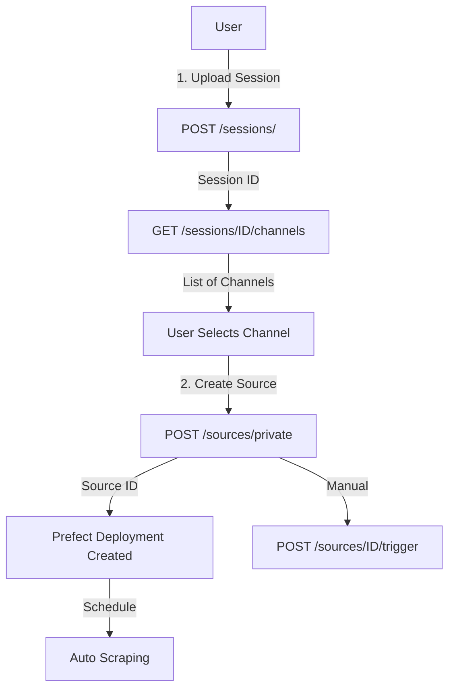
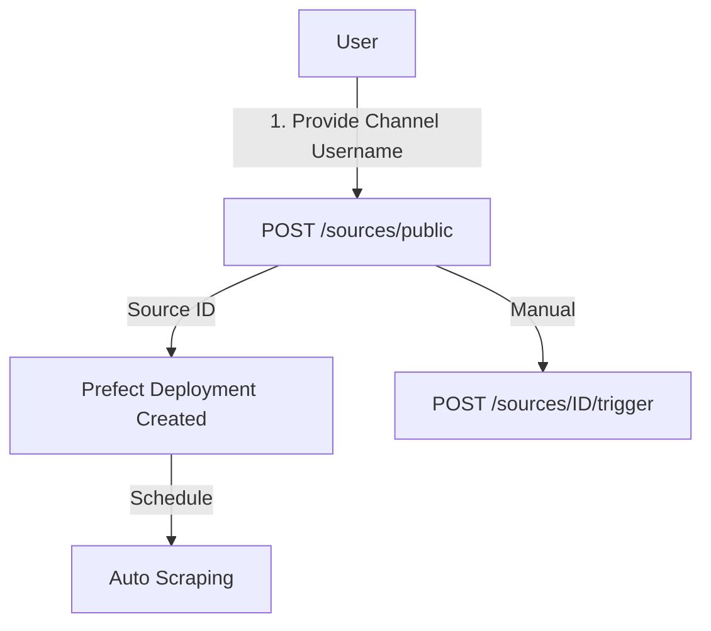

# 🎉 Session Management Implementation - Complete!

## ✅ What Was Implemented

### 1. **Database Models**
- ✅ `TelegramSession` model for storing user sessions
- ✅ Updated `Source` model with session references
- ✅ Foreign key relationship between sources and sessions
- ✅ Encryption for sensitive data (api_hash, session_string)

### 2. **API Routes**

#### Session Routes (`/sessions`)
- ✅ `POST /sessions/` - Upload and store session
- ✅ `GET /sessions/` - List all sessions
- ✅ `GET /sessions/{id}` - Get session details
- ✅ `PUT /sessions/{id}` - Update session
- ✅ `DELETE /sessions/{id}` - Delete session
- ✅ `GET /sessions/{id}/channels` - **Fetch all accessible channels**
- ✅ `POST /sessions/{id}/test` - Test session validity

#### Source Routes (`/sources`)
- ✅ `POST /sources/private` - Create source for private channel
- ✅ `POST /sources/public` - Create source for public channel  
- ✅ `GET /sources/` - List all sources
- ✅ `GET /sources/{id}` - Get source details
- ✅ `PUT /sources/{id}` - Update source
- ✅ `DELETE /sources/{id}` - Delete source
- ✅ `POST /sources/{id}/trigger` - Manual trigger

### 3. **Services**
- ✅ `TelegramClientService` - Telethon integration
  - Get user channels
  - Verify public channels
  - Test session validity
- ✅ Updated `PrefectClient` - Deployment management
- ✅ `Encryption` - Secure data storage

### 4. **Schemas (Pydantic)**
- ✅ `SessionCreate`, `SessionResponse`, `SessionUpdate`
- ✅ `ChannelInfo` - Channel details from Telegram
- ✅ `SourceCreatePrivate`, `SourceCreatePublic`
- ✅ `SourceResponse`, `SourceUpdate`

### 5. **Dependencies**
- ✅ Added `telethon` for Telegram API
- ✅ Added `pydantic` for validation

### 6. **Documentation**
- ✅ `API_GUIDE.md` - Complete API documentation
- ✅ `TELETHON_SETUP.md` - Session generation guide
- ✅ `PREFECT_DEPLOYMENT.md` - Deployment flow docs

---

## 🔄 Complete Workflows

### Private Channel Workflow



### Public Channel Workflow



---

## 📂 File Structure

```
backend/
├── app/
│   ├── main.py                    ✅ Updated with new routes
│   ├── models/
│   │   ├── session.py             ✅ NEW - TelegramSession model
│   │   └── source.py              ✅ Updated with session FK
│   ├── schemas/
│   │   ├── session.py             ✅ NEW - Session schemas
│   │   └── source.py              ✅ Updated schemas
│   ├── api/
│   │   ├── routes_sessions.py     ✅ NEW - Session endpoints
│   │   ├── routes_sources.py      ✅ Updated - Private/Public sources
│   │   └── routes_flows.py        ✅ Existing
│   ├── services/
│   │   ├── telegram_client.py     ✅ NEW - Telethon integration
│   │   ├── prefect_client.py      ✅ Existing
│   │   └── encryption.py          ✅ Existing
│   └── ...
├── requirements.txt               ✅ Added telethon, pydantic
├── API_GUIDE.md                   ✅ NEW - API documentation
├── TELETHON_SETUP.md              ✅ NEW - Session generation guide
├── PREFECT_DEPLOYMENT.md          ✅ Existing
└── docker-compose.yml             ✅ Existing
```

---

## 🚀 Next Steps to Deploy

### 1. **Rebuild Containers**

```bash
docker-compose down
docker-compose up --build -d
```

### 2. **Verify Health**

```bash
curl http://localhost:8000/health
```

### 3. **View API Docs**

Open: http://localhost:8000/docs

### 4. **Generate Telegram Session**

Follow `TELETHON_SETUP.md`:

```bash
pip install telethon
python generate_session.py
# Copy the session string
```

### 5. **Upload Session**

```bash
curl -X POST http://localhost:8000/sessions/ \
  -F "name=My Account" \
  -F "phone_number=+1234567890" \
  -F "api_id=12345678" \
  -F "api_hash=your_hash" \
  -F "session_string=your_string"
```

### 6. **Get Channels**

```bash
curl http://localhost:8000/sessions/{session-id}/channels
```

### 7. **Create Source**

```bash
curl -X POST http://localhost:8000/sources/private \
  -H "Content-Type: application/json" \
  -d '{
    "name": "My Scraper",
    "api_id": 12345678,
    "api_hash": "your_hash",
    "session_id": "session-uuid",
    "channel_id": 1234567890,
    "channel_title": "Channel Name",
    "file_types": ["pdf"],
    "target": "LOCAL",
    "schedule": "0 */6 * * *"
  }'
```

### 8. **Monitor**

- **API**: http://localhost:8000/docs
- **Prefect**: http://localhost:4200

---

## 🎯 Key Features

### ✨ Highlights

1. **Session Management**
   - Secure encrypted storage
   - Validation on upload
   - Reusable across multiple sources
   - Test endpoint for validation

2. **Channel Discovery**
   - Automatic channel listing
   - Rich metadata (member count, type, etc.)
   - Support for both public and private

3. **Flexible Source Creation**
   - Separate workflows for private/public
   - Session-based authentication
   - Optional bot token support
   - File type filtering

4. **Automated Scheduling**
   - Prefect integration
   - Cron-based scheduling
   - Manual trigger option
   - Deployment lifecycle management

5. **Security**
   - All sensitive data encrypted
   - Session validation
   - Protected deletion (FK constraints)
   - Secure credential handling

---

## 🔐 Security Considerations

- ✅ All API hashes encrypted
- ✅ All session strings encrypted
- ✅ Bot tokens encrypted
- ✅ Session validation before use
- ✅ Cannot delete sessions in use
- ✅ Session test endpoint for monitoring

---

## 📊 Database Schema

```sql
-- Sessions Table
CREATE TABLE telegram_sessions (
    id VARCHAR PRIMARY KEY,
    name VARCHAR NOT NULL,
    phone_number VARCHAR UNIQUE NOT NULL,
    session_string TEXT NOT NULL,  -- Encrypted
    api_id INTEGER NOT NULL,
    api_hash VARCHAR NOT NULL,      -- Encrypted
    is_active VARCHAR DEFAULT 'active',
    created_at TIMESTAMP,
    updated_at TIMESTAMP
);

-- Sources Table (Updated)
CREATE TABLE sources (
    id UUID PRIMARY KEY,
    name VARCHAR NOT NULL,
    api_id VARCHAR NOT NULL,        -- Encrypted
    api_hash VARCHAR NOT NULL,      -- Encrypted
    access_level VARCHAR NOT NULL,   -- 'public' or 'private'
    identifier VARCHAR NOT NULL,
    channel_title VARCHAR,
    session_id VARCHAR REFERENCES telegram_sessions(id),
    bot_token VARCHAR,              -- Encrypted
    file_types JSON,
    target VARCHAR NOT NULL,
    target_path VARCHAR,
    schedule VARCHAR,
    is_active VARCHAR DEFAULT 'active',
    created_at TIMESTAMP,
    updated_at TIMESTAMP,
    last_scraped_at TIMESTAMP,
    total_messages_scraped INTEGER DEFAULT 0,
    total_files_downloaded INTEGER DEFAULT 0
);
```

---

## 🎓 Usage Examples

### Example 1: Private Channel

```python
import requests

API = "http://localhost:8000"

# 1. Create session
session = requests.post(f"{API}/sessions/", data={
    "name": "Main Account",
    "phone_number": "+1234567890",
    "api_id": 12345678,
    "api_hash": "abc123",
    "session_string": "1ApWapz..."
}).json()

# 2. Get channels
channels = requests.get(
    f"{API}/sessions/{session['id']}/channels"
).json()

# 3. Create source for first private channel
private_channel = next(ch for ch in channels if ch['is_private'])

source = requests.post(f"{API}/sources/private", json={
    "name": f"Scraper for {private_channel['title']}",
    "api_id": 12345678,
    "api_hash": "abc123",
    "session_id": session['id'],
    "channel_id": private_channel['id'],
    "channel_title": private_channel['title'],
    "file_types": ["pdf", "zip"],
    "target": "LOCAL",
    "schedule": "0 */6 * * *"
}).json()

print(f"Source created: {source['id']}")
```

### Example 2: Public Channel

```python
import requests

API = "http://localhost:8000"

# Create public source directly
source = requests.post(f"{API}/sources/public", json={
    "name": "Tech News Scraper",
    "api_id": 12345678,
    "api_hash": "abc123",
    "channel_username": "@technews",
    "file_types": ["pdf"],
    "target": "NAS",
    "target_path": "/nas/tech",
    "schedule": "0 0 * * *"  # Daily at midnight
}).json()

# Manually trigger immediately
requests.post(f"{API}/sources/{source['id']}/trigger")

print(f"Source created and triggered: {source['id']}")
```

---

## 🎉 Success!

The system is now ready with:
- ✅ Complete session management
- ✅ Channel discovery
- ✅ Private/public source workflows
- ✅ Automated scheduling
- ✅ Security & encryption
- ✅ Full API documentation

**Start scraping! 🚀**
